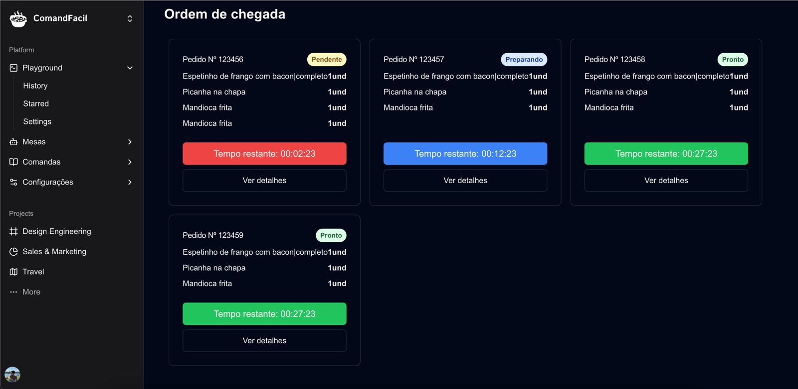

---

# Comanda Fácil

Comanda Fácil é um sistema de gerenciamento de pedidos de um restaurante, desenvolvido para facilitar a visualização e controle de comandas. O projeto oferece uma interface limpa e fácil de usar para gerenciar pedidos, visualizar o status dos pedidos e acompanhar o tempo restante de cada item no pedido.

## Funcionalidades

- **Visualização de Pedidos**: Lista os pedidos em tempo real com informações detalhadas.
- **Gerenciamento de Status de Pedidos**: Acompanhamento do status de cada pedido (pendente, preparando, pronto).
- **Contagem de Tempo**: Mostra o tempo restante para a finalização de cada pedido.
- **Interface Responsiva**: Design adaptável para dispositivos móveis e desktops.
- **Sidebar Interativa**: Menu lateral com links de navegação para fácil acesso aos recursos.




## Tecnologias Utilizadas

- **Frontend**:
  - React (Next.js)
  - Tailwind CSS
  - TypeScript
  - Zustand para gerenciamento de estado
- **Backend**:
  - (Caso o backend seja necessário, adicione a tecnologia aqui, por exemplo, Node.js, Express, etc.)
- **Outras ferramentas**:
  - Vercel (Deploy)
  - Axios (Para requisições HTTP, caso necessário)

## Instalação

Siga os passos abaixo para rodar o projeto localmente:

### 1. Clone o repositório

```bash
git clone https://github.com/seu-usuario/comanda-facil.git
```

### 2. Instale as dependências

Navegue até a pasta do projeto e instale as dependências:

```bash
cd comanda-facil
npm install
```

### 3. Execute o projeto

Para rodar o projeto localmente, use o comando abaixo:

```bash
npm run dev
```

Isso iniciará o servidor de desenvolvimento e você poderá acessar a aplicação em `http://localhost:3000`.

## Estrutura do Projeto

```bash
comanda-facil/
├── app/                  # Componentes e páginas principais do projeto
│   ├── _components/      # Componentes reutilizáveis
│   ├── comandas/         # Página de visualização das comandas
│   └── _components/ui/   # Componentes da interface (botões, listas, etc.)
├── public/               # Arquivos estáticos (imagens, fontes, etc.)
├── styles/               # Arquivos de estilo
├── types/                # Definições de tipos do TypeScript
├── next.config.js        # Configuração do Next.js
└── package.json          # Dependências e scripts
```

### Detalhes dos Componentes

- **AppSidebar**: Menu lateral com navegação entre diferentes partes do sistema.
- **Comandas**: Exibe a lista de pedidos com detalhes e status.
- **OrderList**: Lista de pedidos a serem processados.
- **OrderDetails**: Exibe detalhes específicos sobre um pedido.
- **OrderCard**: Cartão que representa um pedido individual.

## Contribuindo

Contribuições são bem-vindas! Se você deseja contribuir para o projeto, siga as etapas abaixo:

1. Fork o repositório.
2. Crie uma nova branch (`git checkout -b feature/nova-feature`).
3. Faça as modificações necessárias e commit suas mudanças.
4. Envie um Pull Request explicando suas mudanças.

## Testes

Para rodar os testes do projeto (caso você tenha configurado testes automatizados, como Jest, Testing Library, etc.), utilize o seguinte comando:

```bash
npm test
```

## Deploy

Para deploy do projeto, você pode utilizar a Vercel ou outro provedor de sua preferência. Basta conectar seu repositório ao serviço e ele cuidará do deploy automaticamente.

## Licença

Este projeto é licenciado sob a Licença MIT - veja o arquivo [LICENSE](LICENSE) para mais detalhes.

---

Este README cobre as informações básicas sobre o seu projeto "Comanda Fácil". Você pode ajustá-lo de acordo com o seu fluxo de trabalho, outras funcionalidades que você tenha implementado, ou tecnologias que esteja utilizando.